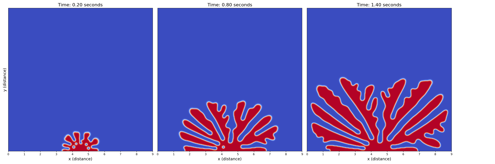
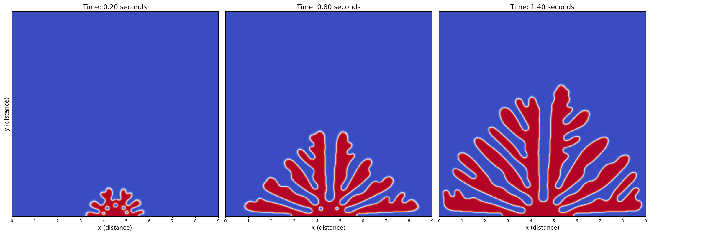
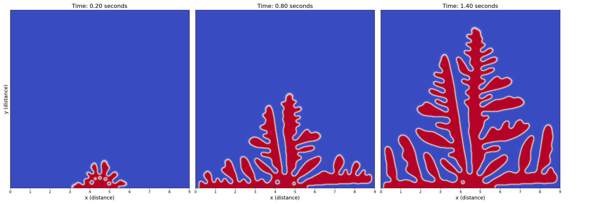
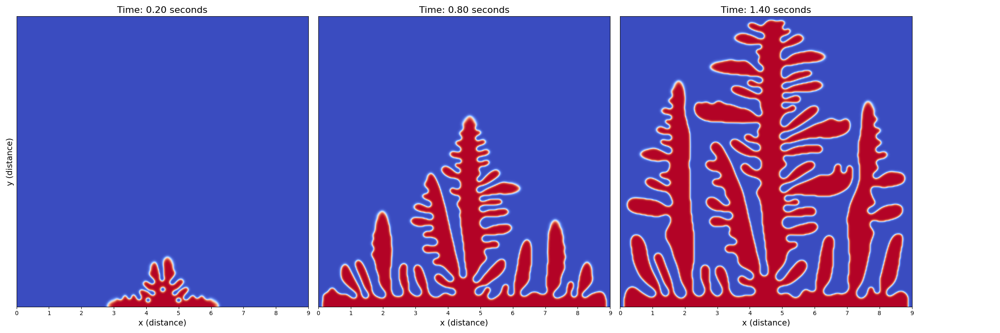
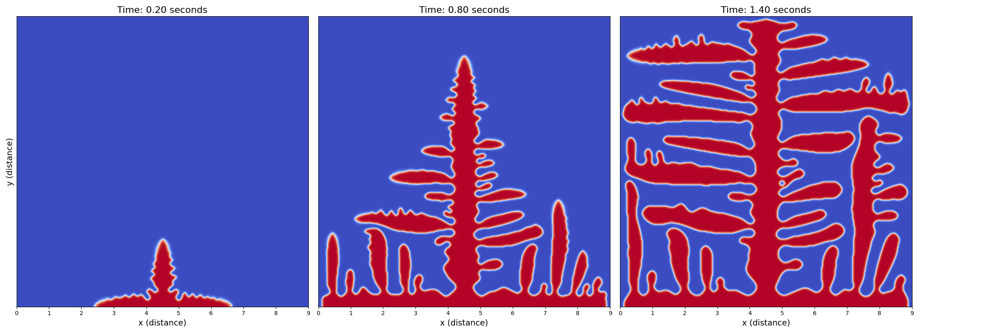

# ice 
Step 18 (Speical Topic 2): Phase-field Method
[drzgan.github/CFD/Phase-field Method](https://drzgan.github.io/Python_CFD/Konayashi_1993-main/jax_version/kobayashi_aniso_jax_ZGAN-2.html)

This code is the tutorial's code converted from Python (Jax) to c++ (CUDA).
The tutorial's code reproduce the results presented in *Modeling and numerical simulations of dendritic crystal growth* by Ryo Kobayashi 

run run.sh in terminal:
```sh
nvcc -arch=compute_75 -code=sm_75 ice.cu -o cu
./cu
python plot.py
python plot_trio.py
```

## Figure 7

### delta = 0.000


### delta = 0.005


### delta = 0.010


### delta = 0.020


### delta = 0.050



## Figure 8

### K = 0.8


### K = 1.0


### K = 1.2


### K = 1.4


### K = 1.6


### K = 2.0


